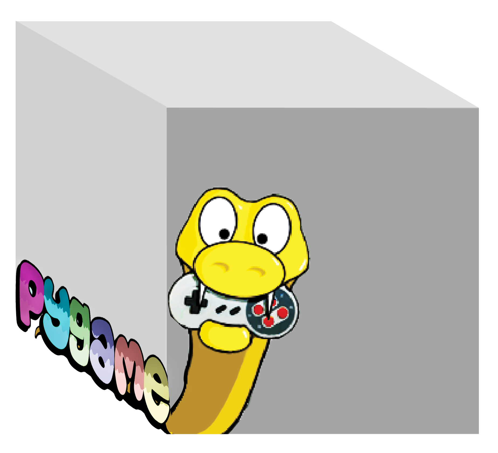

This book contains the notes, slides, code and examples we use in CSI 102 at Muhlenberg College. It is a living document, which will get updated throughout the semester gradually. 

<a property="dct:title" rel="cc:attributionURL" href="https://hamedyaghoobian.com/courses/cs102/">Introduction to Game Programming with Python</a> by <a rel="cc:attributionURL dct:creator" property="cc:attributionName" href="https://hamedyaghoobian.com/">Hamed Yaghoobian</a> is marked with <a href="http://creativecommons.org/publicdomain/zero/1.0?ref=chooser-v1" target="_blank" rel="license noopener noreferrer" style="display:inline-block;">CC0 1.0</a>

