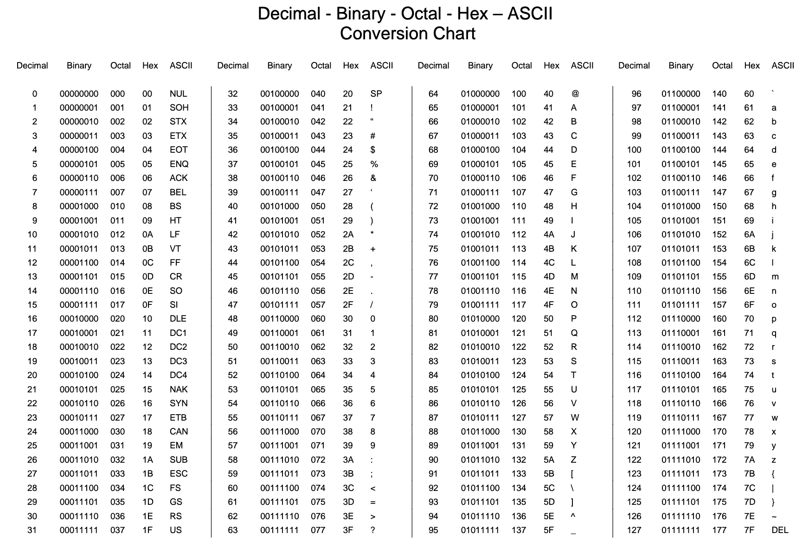

# :bell: Some Data Types in Python

* Integer  (`0`, `12`, `5`, `-5`)
* Float (`4.5`, `3.99`, `0.1`)
* String (`'Hi'`, `"""Hello"""`, `"Hi there!;)"`)
* Boolean (`True`, `False`)
* List (`[ “hi”, “there”, “you” ]` )
* Tuple (`( 4, 2, 7, 3)`)

:pencil: In Python variables are *dynamically* typed. In some languages you have to explicitly declare the type. 


# Type Conversion
* Data may not always be stored in the form we want
    * `input()` always returns string data
    * Diving two integers but want a floating point result

* Python can convert between data types in two different ways
    * Implicitly 
        * `2 * 3.0`
        * `5 / 2`
    * Explicitly (also called Type Casting)


## Explicit Conversion (Type Casting)
Type Casting allows for the dynamic conversion of data to a specified type, if possible!
* `int(“5”)`
* `float(input("Please enter your weight in lbs:"))`
* `str(42)`
* `bool(1)`

Variables can also be cast, but the original value is not altered
* `var = "5"`
* `var2 = int(var)`

# String Conversions
* You can also use `int()` and `float()` to convert between strings and integers

  ```console
  >>> sval = '123'
  >>> type(sval)
  <type 'str'>
  ```

  ```console
  >>> print(sval+1)
  Traceback (most recent call last):
    File "<stdin>", line 1, in <module>
  TypeError: can only concatenate str (not "int") to str
  ```

  ```console
  >>> ival = int(sval)
  >>> type(ival)
  <class 'int'>
  >>> print(ival+1)
  124
  ```


# Data Storage
* Computers do not store integers, floats, text as actual symbols

* Data is stored in a binary format (0/1)
    * A single 0 or 1 is a bit
    * A series of eight bits make a byte
    * 1024 bytes make a kilobyte
    * 1024 kilobytes make a megabyte


# Binary Formula
* Each position in the binary string represents some power of 2
    * Similar to powers of 10 in decimal

|  $2^7$ | $2^6$ |  $2^5$ | $2^4$ |$2^3$|  $2^2$ |  $2^1$ |$2^0$|
|:----------:|:-------------:|:------:|:----------:|:-------------:|:------:|:----------:|:-------------:|
| 1 | 0 | 0 | 0 | 1 | 1 | 0 | 1 |

To convert from binary (base-2) to decimal (base-10) we just do the math!

$$1*2^7 + 0*2^6 + 0*2^5 + 0*2^4 + 1*2^3 + 1*2^2 + 0*2^1 + 1*2^0
= 1*128 + 1*8 + 1*4 + 1*1 = 141$$


# Going Back
* To convert decimal to binary:
    * repeatedly divide by two until the result is 0  and store the remainder from division.

            141/2 = 70, remainder is 1
            70/2 = 35, remainder is 0
            35/2 = 17, remainder is 1
            17/2 = 8, remainder is 1
            8/2 = 4, remainder is 0
            4/2 = 2, remainder is 0
            2/2 = 1, remainder is 0
            1/2 = 0, remainder is 1

    * Read from the bottom (MSB) to top (LSB) as `10110110`.

* Now you try **182**.
---

# ASCII Table



# Comments
* Formal languages are dense, and it is often difficult to look at a piece of code and figure out what it is doing, or why.

For this reason, it is a good idea to add notes to your programs to explain in natural language what the program is doing. These notes are called comments, and they start with the # symbol:

  ```python
  # compute the percentage of the hour that has elapsed
  percentage = (minute * 100) / 60
  ```

* Be aware of redundancy while commenting
  ```python
  v = 5     # assign 5 to v
  ```


# Debugging :lady_beetle: 
* **Syntax error** refers to the structure of a program and the rules about that structure. For example, `8)` is a `syntax error`. If there is a syntax error anywhere in your program, Python displays an error message and quits, and you will not be able to run the program.

* **Runtime error** does not appear until after the program has started running. These errors are also called *exceptions* because they usually indicate that something exceptional (and bad) has happened. They're rare in simple programs.

* **Semantic error** is related to meaning. If there is a semantic error in your program, it will run without generating error messages, but it will not do the right thing. It will do something else. 

# Exercises :snake:

* Let's make errors on purpose to see what goes wrong

    * We've seen that `n = 42` is legal. What about `42 = n`?
    * How about `x = y = 1`?
    * In some languages every statement ends with a semi-colon, `;`. What happens if you put a *semi-colon* at the end of a Python statement?
    * What if you put a `period` at the end of a statement?
    * In math notation you can multiply `x` and `y` like this: `x y`. What happens if you try that in Python?
